# Examples of work that used Cytosim

[Microtubule organization by mitotic motors](https://doi.org/10.1016/j.cell.2018.09.029)  
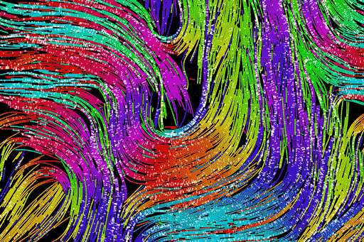

[Self organization in confined space](http://www.cell.com/current-biology/abstract/S0960-9822(09)01025-2)  
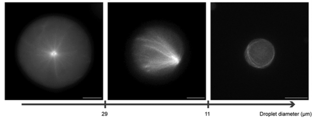

[Optimization of gliding assays](http://pubs.rsc.org/en/Content/ArticleLanding/2012/LC/c2lc40250e#!divAbstract)  

[Mitotic spindle organization](http://www.sciencedirect.com/science/article/pii/S0006349508705137)  
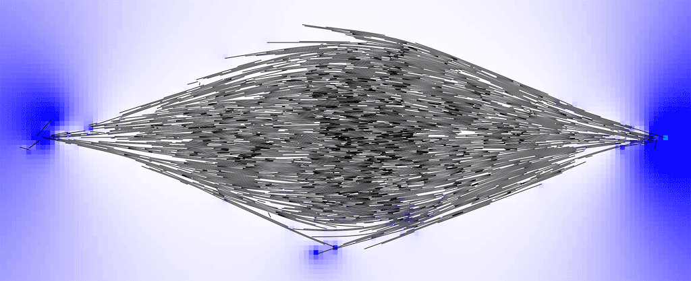

[Dynamic organization of actin](http://www.sciencedirect.com/science/article/pii/S0960982216000543)   
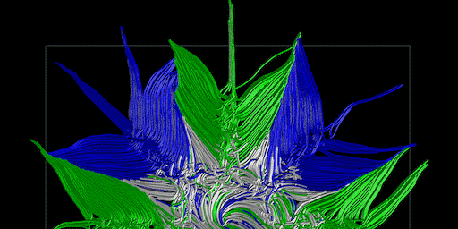

[Contraction of filamentous networks](http://msb.embopress.org/content/13/9/941)  
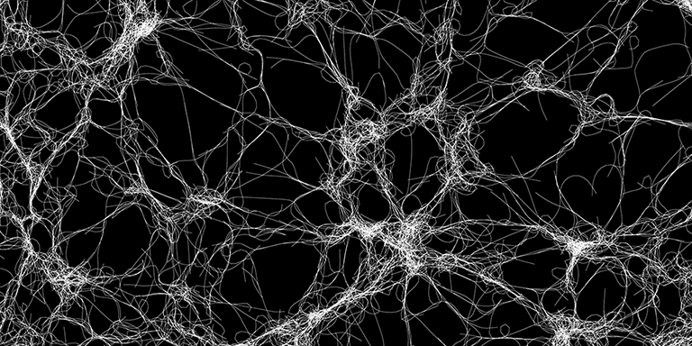

[Centrosome centering](http://www.molbiolcell.org/content/27/18/2833.short)  
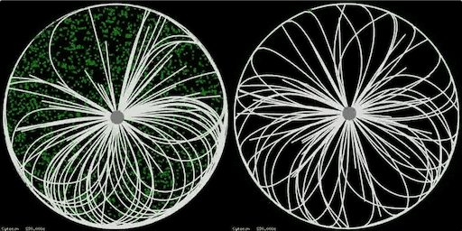

[Formation of microtubules arrays in yeast](http://www.sciencedirect.com/science/article/pii/S0092867407000487)  
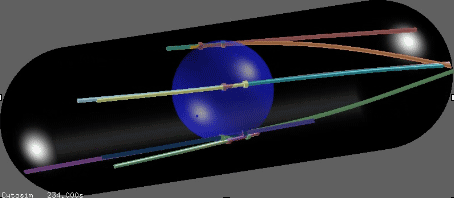

[Nuclear movements in multinucleated fungi](http://www.molbiolcell.org/content/28/5/645.abstract)  
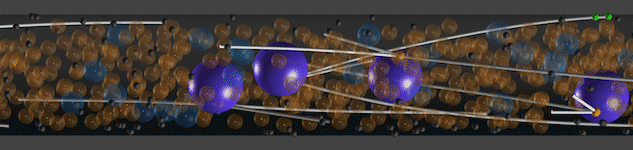

[Nuclear movements during development in C.elegans](http://www.cell.com/cell-reports/abstract/S2211-1247(16)30093-6)  
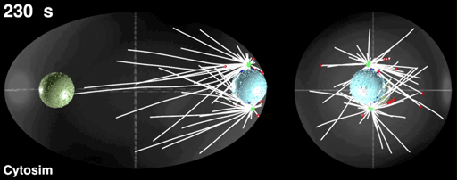

[Endocytosis in yeast](https://doi.org/10.1016/j.cell.2018.06.032)  
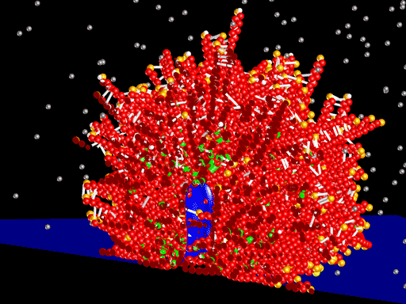

[Regulation of spindle length in C.elegans](https://doi.org/10.1016/j.devcel.2018.04.022)  
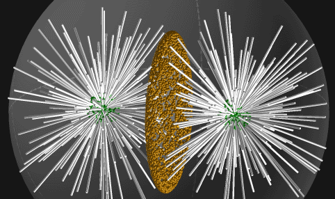

