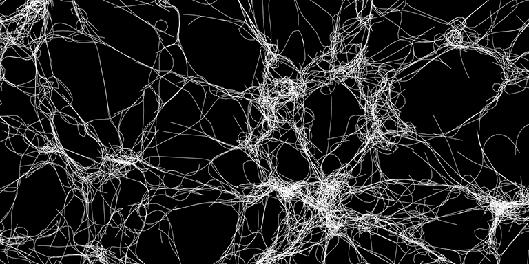

# Cytosim

Cytosim is a cytoskeleton simulation designed to handle large systems of flexible filaments with associated proteins such as molecular motors. It is a versatile base that has been used to study actin and microtubule systems in 1D, 2D and 3D. It is built around a core C++ engine that can run on UNIX, Mac OS, GNU/Linux and within Cygwin on Windows. The code is modular and extensible, allowing Cytosim to be customized to fulfill particular needs.

Cytosim is a suite of command-line tools with simulation and display capabilities. The simulation to be performed is specified in a text file `config.cym`, defining objects, their parameters and a suite of operations, such as advancing time, saving frames or generating report files. Here is a basic example:

    set simul system
    {
        time_step = 0.005
        viscosity = 0.02
    }

    set space cell
    {
        shape = sphere
        dimensions = 5
    }

    set fiber microtubule
    {
        rigidity = 20
        segmentation = 0.5
        confine = inside, 200, cell
    }
        
    new cell

    new 5 microtubule
    {
        length = 11
    }

    run 5000 system
    {
        nb_frames = 10
    }

# Documentation

*  [**Overview**](main/overview.md)
*  [Getting started](main/starter.md)
*  [The configuration file](sim/config.md)
*  [Simulation engine](sim/index.md)
*  [**Tutorials**](tutorials/index.md)
*  [The different executables](main/executables.md)
*  [File types](main/file_types.md)
*  [Running simulations on your computer](main/runs.md)
*  [Standard config files](main/examples.md)
*  [Graphical rendering](sim/graphics.md)
*  [Making movies](main/movies.md)
*  [Getting numbers out of Cytosim](main/report.md)
*  [Running cytosim on a cluster](main/run_slurm.md)
*  [Frequently asked questions](main/faq.md)
*  [Prior work](examples/index.md)

# Installation

Cytosim is distributed as source code and [must be compiled](compile/index.md) before use. On Mac OS X and Linux this should be straightforward if you are familiar with compilation in general. On Windows, we suggest to [compile within Cygwin](compile/cygwin.md).

To compile, enter these commands in a terminal window:

	git clone https://github.com/nedelec/cytosim.git
	cd cytosim
	make

Once cytosim is running on your machine, check the tutorials, the page on [running simulations](main/runs.md), and the examples contained in the folder `cym`. Inspect in particular the short configuration files (e.g. fiber.cym, self.cym). 

#### Troubleshooting

For more information, please check [the dedicated pages](compile/index.md).  
You may need to manually edit the makefiles depending on your platform.

# Advanced matter

*  [Code documentation](code/index.md)
*  [Doxygen documentation](doc/code/doxygen/index.html)

# Contributors

 The Brownian dynamics approach was described in the New Journal of Physics: [Collective Langevin Dynamics of Flexible Cytoskeletal Fibers](http://iopscience.iop.org/article/10.1088/1367-2630/9/11/427/meta).

 The project was started in 1995, and received its name in 1999.
 We hope cytosim can be useful for your research. 
 Sincerely yours, The Developers of Cytosim:

*  Francois Nedelec        1995-
*  Dietrich Foethke        2003-2007
*  Cleopatra Kozlowski     2003-2007
*  Elizabeth Loughlin      2006-2010
*  Ludovic Brun            2008-2010
*  Beat Rupp               2008-2011
*  Jonathan Ward           2008-2014
*  Antonio Politi          2010-2012
*  Andre-Claude Clapson    2011-2013
*  Serge Dmitrieff         2013-
*  Gaelle Letort           2014-
*  Julio Belmonte          2014-
*  Jamie-Li Rickman        2014-
*  Manuel Lera Ramirez     2017-

# Contact

cytosimATcytosimDOTorg

